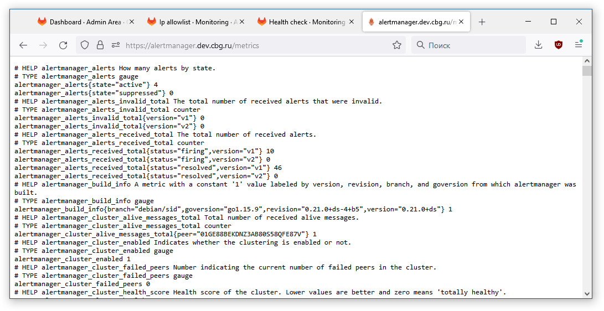

# Дипломное задание по курсу «DevOps-инженер»

## Результаты

### Инфраструктура

Инфраструктура развернута в [Yandex Cloud](https://cloud.yandex.ru/). Файлы описания находятся в каталоге [:file_folder:terraform](https://github.com/ilyagoz/netology-diploma/tree/main/terraform). В качестве базовых используются образы [Debian 11](https://cloud.yandex.ru/marketplace/products/yc/debian-11).

```txt
$ yc compute instances list --folder-name=netology-diploma
+----------------------+--------+---------------+---------+----------------+---------------+
|          ID          |  NAME  |    ZONE ID    | STATUS  |  EXTERNAL IP   |  INTERNAL IP  |
+----------------------+--------+---------------+---------+----------------+---------------+
| epdrffq5cjqphsd63psd | db01   | ru-central1-b | RUNNING |                | 192.168.31.24 |
| fhm5n551qcj2qqq6ena1 | runner | ru-central1-a | RUNNING |                | 192.168.30.23 |
| fhm88f4tndl4m6tlpmfh | gitlab | ru-central1-a | RUNNING |                | 192.168.30.5  |
| fhmcsjdng4cngsk89cat | jump   | ru-central1-a | RUNNING | 84.201.132.248 | 192.168.30.18 |
| fhmmlv17783mvoag555c | nginx  | ru-central1-a | RUNNING | 51.250.71.57   | 192.168.30.19 |
| fhmpginfb0uqkiobvghe | db02   | ru-central1-a | RUNNING |                | 192.168.30.21 |
| fhmq3ckoo3bddl6c3i1r | app    | ru-central1-a | RUNNING |                | 192.168.30.17 |
+----------------------+--------+---------------+---------+----------------+---------------+
```

Предусмотрено два каталога в Yandex Cloud: `netology-diploma` и `netology-diploma-prod` и, соответственно, два workspace для них:
```
$ terraform workspace list
  default
  prod
* stage
```

Если выбрать workspace `prod`, то вся инфраструктура будет развертываться в каталоге `netology-diploma-prod`, если `stage` - то в каталоге `netology-diploma`. Инфраструктура организована по распространенной схеме внутренней сети с  [инсталляционным сервером (или jump-сервером)](https://ru.wikipedia.org/wiki/%D0%98%D0%BD%D1%81%D1%82%D0%B0%D0%BB%D0%BB%D1%8F%D1%86%D0%B8%D0%BE%D0%BD%D0%BD%D1%8B%D0%B9_%D1%81%D0%B5%D1%80%D0%B2%D0%B5%D1%80), через который осуществляется административный доступ к внутренним ресурсам посредством SSH. Подробнее о настройках SSH см. раздел "Пояснения". Внешний IP имеют только веб-сервер и jump-сервер. Таким образом, для перехода между разными окружениями достаточно лишь указать в конфигурации SSH другой адрес jump-сервера.

Вся инфраструктура может быть создана командой `terraform apply`, выполненной в каталоге [:file_folder:terraform](https://github.com/ilyagoz/netology-diploma/tree/main/terraform). Предварительно нужно задать переменную окружения `YC_TOKEN` - подробнее об этом см. в документации по [OAuth-токен](https://cloud.yandex.ru/docs/iam/concepts/authorization/oauth-token) - а также идентификаторы вашего облака и каталога Yandex Cloud (переменные в начале файла `main.tf`). Вам понадобится также [бакет](https://cloud.yandex.ru/docs/storage/concepts/bucket) в облаке для хранения конфигурации Terraform (если вы хотите использовать этот метод, а не локальное хранение). Данные для доступа к сервисному аккаунту следует положить к себе в `~/.aws/credentials`.

Наконец, необходимо отредактировать файл [cloud-config](https://github.com/ilyagoz/netology-diploma/blob/main/terraform/cloud-config.yml) и заменить там имя пользователя и публичный ключ на свои. Этот ключ будет устанавливаться на машины для администрирования, и, если вы его не замените, то доступ к машинам будет у меня, а не у вас. **ВНИМАНИЕ: используйте только специально созданный для этой задачи ключ.** В процессе установки раннера для GitLab он получит приватный ключ, необходимый ему для того, чтобы иметь возможность развертывать приложение на веб-сервере. (Да, правильно было бы генерировать для раннера специальный ключ, а еще лучше - использовать настоящую систему управления ключами. Это лишь некоторые из возможностей совершенствования нашей инфраструктуры).

Доменное имя зарегистрировано.

```
$ dig www.dev.cbg.ru

; <<>> DiG 9.16.33-RH <<>> www.dev.cbg.ru
;; global options: +cmd
;; Got answer:
;; ->>HEADER<<- opcode: QUERY, status: NOERROR, id: 21284
;; flags: qr rd ad; QUERY: 1, ANSWER: 3, AUTHORITY: 0, ADDITIONAL: 0
;; WARNING: recursion requested but not available

;; QUESTION SECTION:
;www.dev.cbg.ru.                        IN      A

;; ANSWER SECTION:
www.dev.cbg.ru.         0       IN      A       <b>51.250.71.57</b>
ns1.yandexcloud.net.    0       IN      A       84.201.185.208
ns2.yandexcloud.net.    0       IN      A       84.201.189.229

;; Query time: 0 msec
;; SERVER: 192.168.240.1#53(192.168.240.1)
;; WHEN: Wed Sep 28 19:15:07 +07 2022
;; MSG SIZE  rcvd: 132
```

В сети используется статическая маршрутизация и [NAT-шлюз](https://cloud.yandex.ru/docs/vpc/operations/create-nat-gateway):

```
$ yc vpc route-table show nat-route --folder-name=netology-diploma
id: enphd5u984hg4v2hh4c4
folder_id: b1g8ok924udnrjpvt6e2
created_at: "2022-09-24T04:47:42Z"
name: nat-route
network_id: enpepr16v8rll7m8gels
static_routes:

- destination_prefix: 0.0.0.0/0
    gateway_id: enpkq192r8r9et9k51bc
```

Инфраструктура описана и полностью управляется с помощью [Terraform](https://www.terraform.io).

```
$ terraform workspace list
  default
  prod
* stage

$ terraform plan
yandex_vpc_gateway.nat-gateway: Refreshing state... [id=enpkq192r8r9et9k51bc]
yandex_vpc_network.network1: Refreshing state... [id=enpepr16v8rll7m8gels]
yandex_vpc_address.app_ip_address: Refreshing state... [id=e9bh6kg1k2rn5jje1v9a]
yandex_vpc_route_table.nat-route: Refreshing state... [id=enphd5u984hg4v2hh4c4]
yandex_dns_zone.dev-cbg-ru: Refreshing state... [id=dnsbrdpvakk6ssgmdnmp]
yandex_vpc_subnet.subnet-a: Refreshing state... [id=e9beju2evgcfm94c0t5f]
yandex_vpc_subnet.subnet-b: Refreshing state... [id=e2lsegm02fp1afg9a0ho]
yandex_compute_instance.db01: Refreshing state... [id=epdrffq5cjqphsd63psd]
yandex_dns_recordset.rs["prometheus"]: Refreshing state... [id=dnsbrdpvakk6ssgmdnmp/prometheus.dev.cbg.ru./A]
yandex_dns_recordset.rs["runner"]: Refreshing state... [id=dnsbrdpvakk6ssgmdnmp/runner.dev.cbg.ru./A]
yandex_compute_instance.gitlab: Refreshing state... [id=fhm88f4tndl4m6tlpmfh]
yandex_dns_recordset.rs["grafana"]: Refreshing state... [id=dnsbrdpvakk6ssgmdnmp/grafana.dev.cbg.ru./A]
yandex_compute_instance.nginx: Refreshing state... [id=fhmmlv17783mvoag555c]
yandex_compute_instance.jump: Refreshing state... [id=fhmcsjdng4cngsk89cat]
yandex_compute_instance.app: Refreshing state... [id=fhmq3ckoo3bddl6c3i1r]
yandex_compute_instance.runner: Refreshing state... [id=fhm5n551qcj2qqq6ena1]
yandex_compute_instance.db02: Refreshing state... [id=fhmpginfb0uqkiobvghe]
yandex_dns_recordset.rs["www"]: Refreshing state... [id=dnsbrdpvakk6ssgmdnmp/www.dev.cbg.ru./A]
yandex_dns_recordset.rs["alertmanager"]: Refreshing state... [id=dnsbrdpvakk6ssgmdnmp/alertmanager.dev.cbg.ru./A]
yandex_dns_recordset.rs["app"]: Refreshing state... [id=dnsbrdpvakk6ssgmdnmp/app.dev.cbg.ru./A]
yandex_dns_recordset.rs["gitlab"]: Refreshing state... [id=dnsbrdpvakk6ssgmdnmp/gitlab.dev.cbg.ru./A]

No changes. Your infrastructure matches the configuration.

Terraform has compared your real infrastructure against your configuration and found no differences, so no changes
are needed.
```

Бекэндом Terraform служит бакет в Yandex Cloud:

```terra
backend "s3" {
  endpoint = "storage.yandexcloud.net"
  bucket   = "tf-backend"
  region   = "ru-central1"
  key      = "terraform.tfstate"

  shared_credentials_file = "~/.aws/credentials"
  profile                 = "netology-diploma"

  skip_region_validation      = true
  skip_credentials_validation = true
}
```

Конфигурирование машин выполняется с помощью [Ansible](https://www.ansible.com) (за исключением настройки учетной записи и репозитория в GitLab, подключения раннера и прочих настроек сборки и развертывания. Сама сборка и развертывание, естественно, автоматизированы).

```
$ ansible-playbook  testrole.yml --check -i ./inventory/inventory.ini --ask-vault-pass

[...пропущен ряд строк...]

PLAY RECAP **********************************************************************************************************
app.ru-central1.internal   : ok=18   changed=4    unreachable=0    failed=0    skipped=1    rescued=0    ignored=0
db01                       : ok=16   changed=0    unreachable=0    failed=0    skipped=2    rescued=0    ignored=0
db02                       : ok=14   changed=0    unreachable=0    failed=0    skipped=3    rescued=0    ignored=0
gitlab.ru-central1.internal : ok=3    changed=1    unreachable=0    failed=0    skipped=2    rescued=0    ignored=0

nginx.ru-central1.internal : ok=13   changed=3    unreachable=0    failed=0    skipped=5    rescued=0    ignored=0
runner.ru-central1.internal : ok=5    changed=0    unreachable=0    failed=0    skipped=1    rescued=0    ignored=0
```

Обратный прокси на базе [NGINX](https://www.nginx.com) с сертификатом [Let's Encrypt](https://letsencrypt.org) работает, доступ к сайтам во внутренней сети через него работает.

[GitLab](https://about.gitlab.com/install) установлен и работает:


[WordPress](https://wordpress.org) установлен и работает:


Репликация базы данных MySQL работает:

```
mysql> show slave status\G
*************************** 1. row ***************************
               Slave_IO_State: Waiting for source to send event
                  Master_Host: db01.ru-central1.internal
                  Master_User: repl_user
                  Master_Port: 3306
                Connect_Retry: 60
              Master_Log_File: binlog.000007
          Read_Master_Log_Pos: 197
               Relay_Log_File: db02-relay-bin.000002
                Relay_Log_Pos: 367
        Relay_Master_Log_File: binlog.000007
             Slave_IO_Running: Yes
            Slave_SQL_Running: Yes
```

Мастер-сервер (`db01`) и реплика (`db02`) расположены в подсетях `subnet-b` и `subnet-a`, находящихся в зонах доступности `ru-central1-b` и  `ru-central1-a`, соответственно.

```
$ yc vpc subnet list --folder-name=netology-diploma
+----------------------+----------+----------------------+----------------------+---------------+-------------------+
|          ID          |   NAME   |      NETWORK ID      |    ROUTE TABLE ID    |     ZONE      |       RANGE       |
+----------------------+----------+----------------------+----------------------+---------------+-------------------+
| e2lsegm02fp1afg9a0ho | subnet-b | enpepr16v8rll7m8gels | enphd5u984hg4v2hh4c4 | ru-central1-b | [192.168.31.0/24] |
| e9beju2evgcfm94c0t5f | subnet-a | enpepr16v8rll7m8gels | enphd5u984hg4v2hh4c4 | ru-central1-a | [192.168.30.0/24] |
+----------------------+----------+----------------------+----------------------+---------------+-------------------+
```

### CI/CD

Для развертывания приложения у нас используется Ansible, и поэтому для GitLab сделан специальный runner типа `shell` с установленным на нем Ansible. [Ansible-роль для раннера](https://github.com/ilyagoz/netology-diploma/tree/main/roles/runner) имеется в коде.

Полноценная организация управления инфраструктурой через GitLab в рамках данной работы не предусматривалась. Перенос ее на платформу [Terraform + GitLab](https://docs.gitlab.com/ee/user/infrastructure/iac/index.html) предполагается осуществить в ходе последипломного образования :muscle:.  Поэтому развертывание приложения осуществляется ad hoc-скриптом `deploy.sh` (лежит в каталоге `install-scripts`), который предполагает, что описанная в конфигурации инфраструктура уже существует. Скрипт работает следующим образом.

- Из [настоящего репозитория Github](https://github.com/ilyagoz/netology-diploma.git) скачивается исходный код  описания инфраструктуры и кладется в подкаталог дерева исходников (WordPress), подготовленного для сборки GitLab.
- Исходники WordPress со сделанными изменениями упаковываются в архив, аналогичный дистрибутиву WordPress.
- В подкаталоге запускается скрипт Ansible, выполняющий установку WordPress на сервер по той же роли, как и при первичном развертывании инфраструктуры.

(Неплохо было бы, конечно, на время установки вывесить на сайте заглушку.)

```bash
# !/bin/bash

BUILD_DIR=$(mktemp -d build.XXXXXXXXXX)
git clone <https://github.com/ilyagoz/netology-diploma.git> $BUILD_DIR

name=${PWD##*/}

cd ..
tar --exclude-vcs --exclude-backups --exclude=build.* --exclude=.gitlab-ci.yml --exclude-tag-all=deploy.sh -czf $name/$BUILD_DIR/files/wordpress.tar.gz $name

cd $name/$BUILD_DIR
ansible-playbook install-wp.yml -i ./inventory/inventory.ini --vault-password-file $ANSIBLE_VAULT_PASS
```

Скрипт `.gitlab-ci.yml` выглядит примитивно:

```yaml
stages:
  - build_and_deploy
  - cleanup

ramirez_do_everything:
  stage: build_and_deploy
  script:
    - bash install-scripts/deploy.sh

clean:
  stage: cleanup
  when: always
  script:
    - echo "Time to clean up"
  after_script:
    - rm -rf $CI_PROJECT_DIR
```

#### Пример работы

Делается коммит в локальный репозиторий и отправка в GitLab (git связывается с GitLab через ssh через jump-сервер, поэтому отображается внутреннее имя сервера).


GitLab подхватывает коммит и запускает pipeline, развертывающий приложение с помощью Ansible.


Pipeline успешно завершен.


Исправленный файл отображается в приложении.


При создании тега все происходит аналогично, но при условии, что тег является protected, так как в pipeline используются секреты (в частности, пароль к базе данных WordPress), зашифрованные в скрипте Ansible с паролем, который передается туда через переменные GitLab.

## Мониторинг (Prometheus, Alert Manager, Node Exporter и Grafana)

Стек мониторинга развертывается на сервере `monitoring.ru-central1.internal`, на соответствующие порты которого (9090 для Prometheus, 3000 для Grafana и 9093 для Alertmanager) настроено проксирование через входной NGINX. Развертывание осуществляется ролью monitoring. На все машины кластера устанавливается Node Exporter, развертывание которого делается обычным скриптом `deploy-node-exporter.yml`. Авторизации, к сожалению, нет, поэтому метрики можно читать с любого хоста во внутренней сети.

Мониторинг через дашборд Grafana машины, на которой работает WordPress. Как видно в развернутом списке, данные можно отобразить и с других машин кластера. Используется дашборд [Node Exporter Full](https://grafana.com/grafana/dashboards/1860-node-exporter-full).


Grafana чрезвычайно капризно относится к браузерам. Мне удалось загрузить ее только в Edge.

Мониторинг машин кластера MySQL с помощью [mysqld_exporter](https://github.com/prometheus/mysqld_exporter) и дашборда [Percona](https://grafana.com/grafana/dashboards/7362-mysql-overview), сделано по инструкции [Мониторинг баз данных: MySQL Exporter](https://mcs.mail.ru/docs/additionals/cases/cases-monitoring/case-mysql-exporter). Соответствующие скрипты для установки добавлены в роль для установки MySQL на машинах кластера.


Прямой (без использования Node Exporter) мониторинг сайта на WordPress с помощью плагина [WP Statistics](https://wordpress.org/plugins/wp-statistics).


Наш сайт не очень популярен :slightly_frowning_face:.

### Alert Manager


Файлы конфигурации Alert Manager находятся в каталогах роли `monitoring`. Настроено лишь несколько алертов для примера, в том числе уведомляющие об исчезновении машины, с которой ведется сбор данных. Это очень полезно, учитывая, что мои машины в Yandex Cloud для экономии сделаны прерываемыми.


Имитируем сбой, останавливая виртуальную машину `db02`.

```
$ yc compute instance stop db02 --folder-name=netology-diploma
done (19s)
```

Примерно через минуту получаем письмо.


...а после перезапуска виртуальной машины еще пару - о том, что MySQL упал (MysqlDown), и о том, что он поднялся (Mysqlrestarted).

Все пункты дипломного задания выполнены.

## Пояснения
### Как развернуть инфраструктуру
#### Настройка SSH для доступа Ansible

Прежде всего необходимо настроить доступ по SSH для Ansible. Для связи с машинами кластера используется [инсталляционный сервер (или jump-сервер)](https://ru.wikipedia.org/wiki/%D0%98%D0%BD%D1%81%D1%82%D0%B0%D0%BB%D0%BB%D1%8F%D1%86%D0%B8%D0%BE%D0%BD%D0%BD%D1%8B%D0%B9_%D1%81%D0%B5%D1%80%D0%B2%D0%B5%D1%80) — отдельная виртуальная машина, имеющая как внешний, так и внутренний IP-адрес.

Образец настройки jump-сервера: «[Как настроить SSH-Jump Server](https://habr.com/ru/company/cloud4y/blog/530516/)».

Образец настройки Ansible: «[Using an Ansible playbook with an SSH bastion / jump host](https://www.jeffgeerling.com/blog/2022/using-ansible-playbook-ssh-bastion-jump-host)».

Адрес jump-сервера выводится после создания инфраструктуры в виде jump_host_ip = "<ip-адрес>".

Проще и удобнее всего, на мой взгляд, задать адрес jump-сервера и псевдонимы для хостов внутренней сети в конфигурационном файле SSH (`~/.ssh/config`) следующим образом:
```ssh-config
Host jump
  HostName <внешний ip-адрес jump-сервера>
  User <имя пользователя>
  IdentityFile <путь к файлу приватного ключа>

Host db01 db01.ru-central1.internal
  HostName db01.ru-central1.internal
  ProxyJump jump 
  StrictHostKeyChecking no
```
После этого заходить на хост можно будет просто как `ssh db01`. Ansible тоже получит такую возможность, и в файле 
`inventory.ini` можно будет указывать только имена серверов. Можно добавить приватный ключ к `ssh-agent` с помощью `ssh-add <путь к файлу приватного ключа>`.

`StrictHostKeyChecking no` нужен для того, чтобы не сталкиваться с предупреждениями SSH после пересоздания инфраструктуры. (В случае чего нужно удалить ключ для данного хоста: `ssh-keygen -R db02`) (Да, это немного снижает безопасность).

При создании машин на них устанавливаются ключи для администратора  `<имя>` через параметр в описании для Terraform:

``` terra
metadata = {
    user-data = "${file("cloud-config.yml")}"
}
```

`cloud-config.yml`:

```yaml
users:
  - name: <имя>
    groups: sudo
    shell: /bin/bash
    sudo: ['ALL=(ALL) NOPASSWD:ALL']
    ssh_authorized_keys:
      - <публичный ключ ssh-rsa...>
```

Ведение инвентаря в Ansible просто, так как отпадает необходимость знания динамических IP-адресов. С инсталляционного сервера в YC все машины доступны по именам хостов (в домене `.ru-central1.internal`), и для Ansible инвентарь выглядит предельно просто.

```ini
[admin]
jump

[app]
nginx

[db]
db01.ru-central1.internal
db02.ru-central1.internal
```  

Проверьте доступ к серверам, запустив следующий скрипт на Ansible:

```yaml
- name: Check SSH connections to targets.
  hosts: all
  tasks:
  - action: ping
```

Статический адрес для машины в Yandex Cloud *очень часто* не добавляется после отработки Terraform. Приходится запускать повторно. Или устанавливать вручную через консоль или `yc`.

По абсолютно непонятной причине *иногда* подсеть с готовым route_table_id не создается. Поэтому мы вынуждены воспользоваться CLI и `provisioner "local-exec"`. Это лишает нас возможности вносить изменения без полного пересоздания инфраструктуры, так как терраформ заметит появление `route_table_id` и удалит ее, а провизионера повторно не запустит, ибо при update in-place они не запускаются. Соответствующие заклинания:

```shell
yc vpc route-table list  --folder-id=b1g8ok924udnrjpvt6e2 --format yaml
```

```yaml
- id: enphd5u984hg4v2hh4c4
  folder_id: b1g8ok924udnrjpvt6e2
  created_at: "2022-09-24T04:47:42Z"
  name: nat-route
  network_id: enpepr16v8rll7m8gels
  static_routes:
    - destination_prefix: 0.0.0.0/0
      gateway_id: enpkq192r8r9et9k51bc
```

```shell
yc vpc subnet update subnet-a --route-table-id enphd5u984hg4v2hh4c4 --folder-id b1g8ok924udnrjpvt6e2
yc vpc subnet update subnet-b --route-table-id enphd5u984hg4v2hh4c4 --folder-id b1g8ok924udnrjpvt6e2
```
## Конфигурация установки

Перед запуском скрипта Ansible необходимо ознакомиться с конфигурацией в файле [`config.yml`](https://github.com/ilyagoz/netology-diploma/blob/main/config.yml) и установить нужные значения. В частности, обязательно нужно поменять доменные имена *.dev.cbg.ru, так как они зарегистрированы на меня. Кроме того, нужно указать свой почтовый адрес для регистрации у Let's Encrypt и настроить учетную запись почтового сервера для Alert Manager. Наконец, нужно установить пароли для базы данных. Пароли в файле зашифрованы с помощью Ansible Vault, с очень сложным и надежным паролем, который я не скажу. После этого можно попытаться отдать команды `terraform apply` (в каталоге terraform) и 

`ansible-playbook deploy.yml -i ./inventory/inventory.ini`

в корневом каталоге.

### Установка и настройка MySQL

Официальный способ установки MySQL из репозитория Oracle: [Installing MySQL on Linux Using Debian Packages from Oracle](https://dev.mysql.com/doc/refman/5.7/en/linux-installation-debian.html).

Хороший способ заключается, конечно, в организации локального репозитория нужных пакетов, но это выходит за рамки настоящей работы. Мы установим MySQL из репозитория Debian, что значительно проще и надежнее.

При установке пакет задает вопросы. Список ответов, которые можно заранее установить с помощью модуля `ansible.builtin.debconf`, приведен в [Installing MySQL Non-interactively with MySQL APT Repository](https://dev.mysql.com/doc/mysql-apt-repo-quick-guide/en/#repo-qg-apt-repo-non-insteractive).

Установка производится с помощью Ansible, роль `mysql_common`. Этот этап одинаков для всех серверов БД в нашей группе.
#### Настройка репликации

Репликация настраивается через Ansible с помощью коллекции [`community.mysql`](https://docs.ansible.com/ansible/latest/collections/community/mysql/index.html), в соответствии с инструкциями в документации, глава [Replication](https://dev.mysql.com/doc/mysql-replication-excerpt/5.6/en/replication.html). Используется метод репликации с [GTID](https://dev.mysql.com/doc/refman/8.0/en/replication-gtids.html), как более современный, прогрессивный и простой в настройке.

Конфигурации главного сервера и репликатора отличаются, поэтому они разнесены в разные роли: `mysql_source` и `mysql_replica`, соответственно. В роли `mysql_source` задается необходимый идентификатор `server_id`, создается на ведущем сервере пользователь `repl_user`, от имени которого будет считывать данные репликатор, и, наконец, создается база данных для будущего приложения. В конфигурациях `/etc/mysql/mysql.conf.d/mysqld.cnf`, помимо необходимых настроек для использования GTID, указано через `binlog_do_db=`, что реплицировать нужно только эту базу.

В роли `mysql_replica` база данных не создается, так как она будет создана при начале реплицирования. Для репликатора указывается необходимый идентификатор `server_id`, а затем выдается серия команд `stopreplica`, `changeprimary`, `startreplica`, `getreplica` (последнее только для информации) с одинаковыми параметрами, в том числе `primary_auto_position: true`, указывающим на использование GTID. В результате получаем:

Репликация работает, что показывают параметры `Slave_IO_Running: Yes` и `Slave_SQL_Running: Yes`. Следует отметить, что репликация в MySQL крайне хрупкая и останавливается от любой ошибки в SQL-запросе, после чего ее нужно перезапускать вручную. Учитывая, что наше приложение находится в разработке, и ошибки работы с БД вероятны, рассчитывать на репликацию как на механизм обеспечения отказоустойчивости не стоит. Кроме того, репликация, предусмотренная заданием, работает только в одну сторону, и говорить об автоматическом восстановлении после сбоя не приходится. Репликация, однако, может использоваться для резервного копирования и балансировки нагрузки. Для организации настоящего отказоустойчивого кластера понадобится более сложное решение, например, на основе [InnoDB Cluster](https://dev.mysql.com/doc/mysql-shell/8.0/en/mysql-innodb-cluster.html).

### Установка и настройка NGINX и FastCGI

FastCGI и PHP устанавливаются только на машине `app`, NGINX - на машине `nginx` и `app`. После этого они связываются через проксирование.

**Интересный факт про NGINX.** Если ip-адрес сервера, указанного в качестве upstream, сменится во время работы NGINX (например, потому что виртуальная машина была пересоздана, и ей выделяется динамический адрес, несмотря на сохранение доменного имени), то NGINX будет обращаться по старому адресу, отчего все испортится. Способ борьбы с этим существует: [Using DNS for Service Discovery with NGINX and NGINX Plus](https://www.nginx.com/blog/dns-service-discovery-nginx-plus/).

Настройка связи между NGINX на входе и внутренним на приложении производится так, как подробно описано здесь: [HTTPS behind your reverse proxy](https://reinout.vanrees.org/weblog/2017/05/02/https-behind-proxy.html). При этом на приложении используется самоподписанный сертификат, а NGINX перезашифровывает данные и отдает уже с сертификатом Let's encrypt. Разумеется, правильным enterprise-способом была бы установка во внутренней сети собственного удостоверяющего  центра, например, на основе Hashicorp Vault и централизованная раздача сертификатов через него. Но это выходит за рамки настоящей работы. Тем не менее, решение с самоподписанным сертификатом лучше, чем вообще без сертификата - при этом обеспечивается хотя бы шифрование внутреннего трафика, а приложения работают в условиях нормального https.

### Установка и настройка Gitlab CE и Gitlab Runner

Для развертывания Gitlab используется образ [GitLab 15.3](https://cloud.yandex.ru/marketplace/products/yc/gitlab). Первичная настройка производится с помощью роли Ansible, но ряд дальнейших шагов приходится выполнять вручную. Для работы с репозиторием, созданным в нашей установке GitLab, необходимо зарегистрироваться (я сделал это в качестве пользователя 'root') и загрузить свой публичный ключ. Для удобства адрес репозитория можно внести в `~/.ssh/config` (см. выше). После этого работа с репозиторием проводится как обычно:
```
$ git clone git@gitlab.ru-central1.internal:wpdev/wordpress.git
Cloning into 'wordpress'...
remote: Enumerating objects: 3104, done.
remote: Counting objects: 100% (3/3), done.
remote: Compressing objects: 100% (3/3), done.
remote: Total 3104 (delta 0), reused 0 (delta 0), pack-reused 3101
Receiving objects: 100% (3104/3104), 19.44 MiB | 1.43 MiB/s, done.
Resolving deltas: 100% (514/514), done.
Updating files: 100% (2891/2891), done.

$ cd wordpress/

$ git status
On branch main
Your branch is up to date with 'origin/main'.

nothing to commit, working tree clean
```

Gitlab Runner устанавливается на базовый образ Debian 11. Туда же устанавливается Ansible, с помощью которого (или которой?) Runner будет выполнять развертывание приложения на веб-сервере в ходе CI/CD.

### Установка Prometheus, Alert Manager, Node Exporter и Grafana

Установка и настройка стека мониторинга производится частично в ходе основного развертывания кластера, а Node Exporter развертывается отдельно скриптом Ansible `deploy-node-exporter.yml`. Все они устанавливаются стандартным образом из репозиториев Debian, кроме Grafana, пакет которой приходится скачивать отдельно, так как репозиторий Grafana на момент написания работы не функционировал.

:end:
